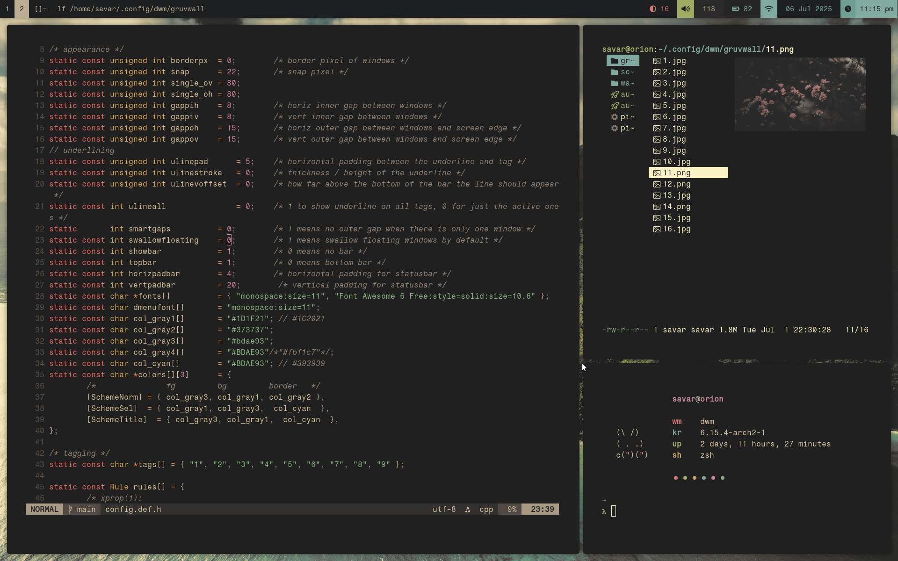

# Dynamic Window Manager
My active build of suckless' dynamic window manager.  
## preview
  

[dwmblocks](https://github.com/savar95x/dwmblocks) - the statusbar  
[dotfiles](https://github.com/savar95x/dotfiles) - my configs

<!--[reddit post](https://www.reddit.com/r/unixporn/comments/15sh6yw/dwm_dream_of_the_endless/)  -->
## patches
The patches that I've used are in the `patches/` directory, do take a look if you're curious  
### what i've added on my own
- single client padding  
- underline tag (the patch does not work)  

the patches are in patches/  
### what i plan on adding
- per tag vanitygaps  

## installation
Clone this repo and run `compiledwm`
```bash
git clone https://github.com/savar95x/dwm
cd dwm
./compiledwm
```  
This should make and install dwm.  

## launching
I use startx from the console. Just make a file in the home of your user `.xinitrc` and add the following stuff
```bash
#!/bin/sh
export XAUTHORITY="$HOME/.local/run/x11/xauth"
setsid -f $HOME/.config/dwm/autostart.sh &
export MYMENU="dmenu"
exec dbus-launch dwm
```  
And make this file `~/.xinitrc` executable  
```bash
$ chmod +x ~/.xinitrc
```  
Now whenever you run `startx` from the linux console, it should run the `~/.xinitrc` file.  

### Thanks
[lukesmith](https://lukesmith.xyz) for his chad way of living
