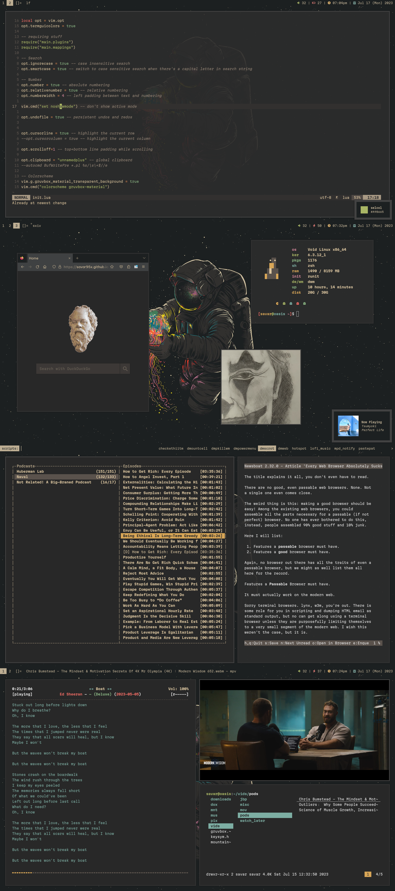

# Dynamic Window Manager
My active build of suckless' dynamic window manager, that I named  
### (Dream of the) Endless
  
Why the name? .. The astronaut in the space represents the endless universe out there. Plus I like The Sandman.  
This is just the dwm source code. You can find the rest of the stuff (along with instrutions on how to implement them) below.  

[dwmblocks](https://github.com/savar95x/dwmblocks) - The statusbar  
[dotfiles](https://github.com/savar95x/dotfiles) - Mostly the stuff stored in the .config directory  

[reddit post](https://www.reddit.com/r/unixporn/comments/15sh6yw/dwm_dream_of_the_endless/)  
### Patches
The patches that I've used are in the `patches/` directory, do take a look if you're curious  

## Installation
Clone this repo and run `compiledwm`
```bash
$ git clone https://github.com/savar95x/dwm
$ cd dwm
$ ./compiledwm
```  
This should make and install dwm.  

## Launching
I use startx from the console. Just make a file in the home of your user `.xinitrc` and add the following stuff
```bash
#!/bin/sh
exec dwm
```  
And make this file `~/.xinitrc` executable  
```bash
$ chmod +x ~/.xinitrc
```  
Now whenever you run `startx` from the linux console, it should run the `~/.xinitrc` file.  

### Thanks
[lukesmith](https://lukesmith.xyz) for his chad way of living
